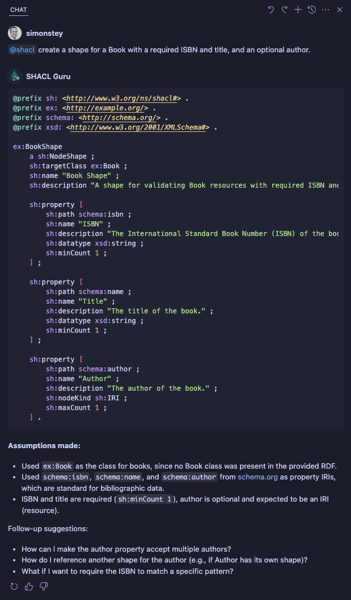

<!-- filepath: /Users/simonstey/vscode/shacl-guru/README.md -->

  

<h1 align="center">SHACL Guru (Whale-idator)</h1>

  <strong>Your intelligent VS Code assistant for SHACL (Shapes Constraint Language).</strong>
   
  Create, understand, modify, and learn SHACL shapes with ease, directly in your editor.

  <!-- TODO: Replace with actual badges -->
  
  
  
  <!-- 
   -->

---

SHACL Guru is a Visual Studio Code chat participant designed to streamline your work with SHACL. Whether you're new to SHACL or an experienced user, SHACL Guru helps you harness the power of SHACL for data validation and schema definition.

## Overview

The Shapes Constraint Language (SHACL) is a W3C recommendation for validating RDF graph data against a set of conditions called "shapes." SHACL Guru acts as your knowledgeable partner, providing a conversational interface to:

*   Generate SHACL shapes from natural language descriptions.
*   Explain complex SHACL structures.
*   Infer shapes from existing RDF data.
*   Learn SHACL best practices.
*   Generate example RDF data based on your shapes.

## Key Features

*   💬 **Natural Language to SHACL:** Describe the data constraints you need in plain English, and SHACL Guru will generate the corresponding SHACL shapes in Turtle syntax.
    *   *Example:* "Create a shape for a Person that must have a name and an optional email address."
*   🔍 **Explain SHACL:** Select any SHACL snippet in your editor and ask SHACL Guru to `/explain` it. Get a clear, detailed breakdown of its components and logic.
*   🔄 **Infer SHACL from RDF:** Got some RDF data? Select it and use `/infer-shape` to let SHACL Guru generate a candidate SHACL shape that describes your data.
*   💡 **SHACL Best Practices:** Use the `/best-practices` command to receive expert tips and recommendations for writing effective and maintainable SHACL shapes.
*   ➕ **Generate Example RDF Data:**
    *   `/generate-conforming`: Get RDF data that successfully validates against your selected SHACL shape.
    *   `/generate-violating`: Get RDF data that intentionally violates your selected SHACL shape, along with an explanation of the violation.
*   ✍️ **Modify Existing Shapes:** Select a SHACL shape and use `/add-constraint` to interactively add new properties or constraints.
*   ❓ **Comprehensive Help:** The `/help` command lists all available functionalities and how to use them.
*   📝 **Context-Aware Assistance:** SHACL Guru intelligently uses your current editor selection (`#selection`) or the content of your active file (`#file`) to provide relevant responses.
*   🚀 **Follow-up Suggestions:** After each interaction, SHACL Guru offers relevant follow-up questions or actions to guide you further.

## Demo

Imagine you have the following requirement: "I need a SHACL shape for a Book. A book must have an ISBN and a title. It can also have an author."

You can simply type into the chat:
`@shacl create a shape for a Book with a required ISBN and title, and an optional author.`

SHACL Guru will respond with the SHACL shape in Turtle syntax.

### Demo GIF

## Installation

1.  Open Visual Studio Code (version 1.100.0 or newer).
2.  Go to the Extensions view (Ctrl+Shift+X or Cmd+Shift+X).
3.  Search for "SHACL Guru".
4.  Click **Install**.
5.  Once installed, you can find SHACL Guru in the Chat view.

## Usage

1.  Open the Chat view in VS Code (View > Chat or Ctrl+Shift+P / Cmd+Shift+P and search "Chat: Focus on Chat View").
2.  In the chat input, type `@shacl` to address SHACL Guru.
3.  You can then either:
    *   Type a natural language request (e.g., `@shacl create a shape for a Product with a SKU and a price.`).
    *   Use a slash command (e.g., `@shacl /explain` after selecting a SHACL shape in your editor).

**Using Context:**

*   **`#selection`**: If you have text selected in your active editor, SHACL Guru can use this as context for commands like `/explain`, `/infer-shape`, `/generate-conforming`, etc.
*   **`#file`**: If no text is selected, some commands might use the content of the active file as context.

## Available Commands

All commands are invoked by typing `@shacl` followed by the command.

*   `/explain`
    *   **Description:** Explains the selected SHACL shape or a SHACL concept mentioned in your prompt.
    *   **Usage:** Select a SHACL snippet in your editor, then type `@shacl /explain`. Or, type `@shacl /explain sh:targetClass`.
*   `/best-practices`
    *   **Description:** Lists best practices for writing high-quality SHACL shapes.
    *   **Usage:** `@shacl /best-practices`
*   `/generate-conforming`
    *   **Description:** Generates example RDF data that conforms to the selected SHACL shape.
    *   **Usage:** Select a SHACL shape in your editor, then type `@shacl /generate-conforming`.
*   `/generate-violating`
    *   **Description:** Generates example RDF data that violates the selected SHACL shape and explains why it violates the shape.
    *   **Usage:** Select a SHACL shape in your editor, then type `@shacl /generate-violating`.
*   `/add-constraint`
    *   **Description:** Helps you add a new property or constraint to a selected SHACL shape.
    *   **Usage:** Select a SHACL NodeShape in your editor, then type `@shacl /add-constraint to add a property for 'description' with sh:datatype xsd:string`.
*   `/infer-shape` (also triggered by "generate a shape for" type queries on RDF data)
    *   **Description:** Infers a SHACL shape from selected RDF data.
    *   **Usage:** Select a snippet of RDF data in Turtle, JSON-LD, or other common RDF formats, then type `@shacl /infer-shape`.
*   `/help`
    *   **Description:** Shows a help message listing all commands and features.
    *   **Usage:** `@shacl /help`

## How It Works

SHACL Guru leverages powerful language models (LLMs) to understand your requests and generate SHACL or explanations. It uses a carefully crafted system prompt that primes the LLM with expertise in SHACL Core specifications and best practices.

When you interact with SHACL Guru:
1.  Your request, along with any context from your editor (selected text via `#selection` or active file content via `#file`), is processed.
2.  This information is combined with the system prompt and recent chat history to form a comprehensive query for the LLM.
3.  The LLM generates a response, which is then streamed back to you in the chat interface.
4.  SHACL Guru aims to always produce SHACL in Turtle (.ttl) syntax unless you specify otherwise.

## Requirements

*   Visual Studio Code version 1.100.0 or later.
*   An active internet connection (for the language model to process requests).

## Extension Settings

Currently, SHACL Guru does not have any specific extension settings. This may change in future releases.

## Known Issues

*   **LLM Dependency:** The quality of responses depends on the underlying language model and the clarity of your prompts. Complex or ambiguous requests might require refinement.
*   **Advanced SHACL/SPARQL:** Some highly advanced or very specific SHACL features (e.g., complex SPARQL-based constraints or SHACL Advanced Features) might not be fully supported or may require manual adjustments to the generated shapes.
*   Please report any issues or unexpected behavior on the [GitHub Issues page](<!-- TODO: Add link to GitHub issues page if available -->).

## Release Notes

For detailed information about changes in each version, please refer to the [CHANGELOG.md](CHANGELOG.md) file.

### 0.0.1
- Initial release with core chat features for SHACL generation, explanation, inference, and example data generation.

## Contributing

Contributions, feedback, and bug reports are highly welcome!

Please open an issue on the [GitHub repository](<!-- TODO: Add link to GitHub repo -->) to discuss any significant changes or to report bugs.

## Support and Feedback

If you encounter any problems or have suggestions for improvement, please:
*   Open an issue on the [GitHub repository](<!-- TODO: Add link to GitHub repo -->).
*   Provide feedback through the VS Code Marketplace.

## Privacy

SHACL Guru processes your chat messages and potentially selected code snippets or file content to provide its services. This data is sent to a language model for processing. Please ensure you are comfortable with this before using the extension, especially with sensitive or proprietary code. Refer to the privacy policy of the underlying language model provider for more details. (Note: As this extension uses `vscode.LanguageModelChatMessage`, it likely leverages VS Code's built-in LLM access, and users should refer to VS Code's own privacy statements regarding chat features).

## License

This extension is licensed under the MIT License.

---

Happy whale-idating with SHACL Guru! 🐳
